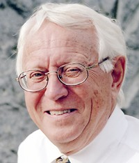

# 作者简历

---

Karl J. Åström 早年就读于斯德哥尔摩的皇家理工学院 (KTH) 。为IBM研究院工作了5年后于1965年在隆德理工大学/隆德大学创建了自动控制系，被聘为该系的客座教授。他现在是隆德大学的高级教授。Åström对于控制的兴趣广博，位于国际自动化学会高引作者之列（ISAHighlyCited）。是IEEE终身会士，他的Erdös数为3。他收获了众多殊荣，包括1987年的国际自动控制联合会（IFAC）Quazza奖章、1990年IEEE控制系统奖、1993年IEEE荣誉奖章和6个荣誉博士学位。他是瑞典皇家科学院、瑞典皇家工程科学院以及美国工程院的院士。

P.R. Kumar 来自德州农工大学。之前曾在马里兰大学巴尔的摩郡分校（UMBC）的数学系、伊利诺伊大学厄巴纳-香槟分校（UIUC）的电子和计算机工程专业（ECE）与该校的计算机科学实验室（CSL）效力。他是IEEE会士、美国工程院院士和发展中国家科学院（the Academy of Sciences of the Developing  World）院士。他曾被苏黎世联邦理工大学（ETH）授予荣誉博士学位，获得过国际计算机学会（ACM）可移动系统特殊兴趣团体（SIGMOBILE）的突出贡献奖、IEEE控制系统领域奖、IEEE通信学分会的Ellersick奖、美国自动控制委员会（AACC）Eckman奖。他是印度理工学院孟买分校（IIT Bombay）的D.J. Gandhi杰出访问教授、印度理工学院海得拉巴分校（IIT Hyderabad）的荣誉教授，还是清华大学无线通信客座教授组的带头人。他获得了印度理工学院马德拉斯分校（IIT Madras）的杰出校友奖、华盛顿大学校友成就奖和UIUC的Drucker Eminent教师奖。

